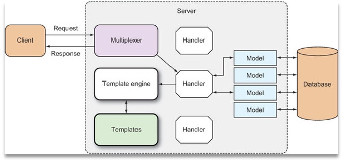

# 模板

## 大纲

+ 简介
+ 模板引擎
+ Action
+ 参数、变量、管道
+ 函数
+ 模板组合
  
## 模板定义

+ Web 模板就是预先设计好的 HTML 页面，它可以被模板引擎反复的使用，来产生 HTML 页面
+ Go 的标准库提供了 text/template，html/template 两个模板库
大多数 Go 的 Web 框架都使用这些库作为 默认的模板引擎

## 模板与模板引擎

模板引擎可以合并模板与上下文数据，产生最终的 HTML

```text
模板————🔽
      模板引擎 ——> HTML
数据————🔼
```

## 两种理想的模板引擎

### 1. 无逻辑模板引擎

+ 通过占位符，动态数据被替换到模板中
+ 不做任何逻辑处理，只做字符串替换
+ 处理完全由 handler 来完成
+ 目标是展示层和逻辑的完全分离

### 2. 逻辑嵌入模板引擎

+ 编程语言被嵌入到模板中
+ 在运行时由模板引擎来执行，也包含替换功能
+ 功能强大
+ 逻辑代码遍布 handler 和 模板，难以维护

## Go 的模板引擎

+ 主要使用的是 text/template，HTML 相关的部分使用了 html/template，是个混合体。
+ 模板可以完全无逻辑，但又具有足够的嵌入特性
+ 和大多数模板引擎一样，Go Web 的模板位于无逻辑和嵌入逻辑之间的某个地方

## Go 模板引擎的工作原理

+ 在 Web 应用中，通产是由 handler 来触发模板引擎

+ handler 调用模板引擎，并将使用的模板传递给引擎
  + 通常是一组模板文件和动态数据
+ 模板引擎生成 HTML，并将其写入到 ResponseWriter
+ ResponseWriter 再将它加入到 HTTP 响应中，返回给客户端


## 关于模板

+ 模板必须是可读的文本格式，扩展名任意。对于 Web 应用通常就是 HTML
  + 里面会内嵌一些命令（叫做 action）
+ text/template 是通用模板引擎，html/template 是 HTML 模板引擎
+ action 位于双层花括号之间：{{ . }}
  + 这里的 . 就是一个 action
  + 它可以命令模板引擎将其替换成一个值

## 模板例子

```html
<!DOCTYPE html>
<html>
  <head>
    <meta http-equiv="Content-Type" content="text/html; charset=utf-8">
    <title>Go Web Programming</title>
  </head>
  <body>
    {{ . }}
  </body>
</html>
```

## 使用模板引擎

1. 解析模板源（可以是字符串或模板文件），从而创建一个解析好的 模板的 struct
2. 执行解析好的模板，并传入 ResponseWriter 和 数据。
   + 这会触发模板引擎组合解析好的模板和数据，来产生最终的 HTML，并将它传递给 ResponseWriter

### 例子

## 解析模板

+ ParseFiles
+ ParseGlob
+ Parse

### ParseFiles

+ 解析模板文件，并创建一个解析好的模板 struct，后续可以被执行
+ ParseFiles 函数是 Template struct 上 ParseFiles 方法的简便调用
+ 调用 ParseFiles 后，会创建一个新的模板，模板的名字是文件名
+ New 函数
+ ParseFiles 的参数数量可变，但只返回一个模板
  + 当解析多个文件时，第一个文件作为返回的模板（名、内容），其余的作为 map，供后续执行使用

#### 例子

### ParseGlob

使用模式匹配来解析特定的文件

#### 例子

### Parse

可以解析字符串模板，其它方式最终都会调用 Parse

### Lookup 方法

通过模板名来寻找模板，如果没找到就返回 nil

### Must 函数

+ 可以包裹一个函数，返回到一个模板的指针 和 一个错误。
  + 如果错误不为 nil，那么就 panic

## 执行模板

### Execute

+ 参数是 ResponseWriter、数据
+ 单模板：很适用
+ 模板集：只用第一个模板

### ExecuteTemplate

+ 参数是：ResponseWriter、模板名、数据
+ 模板集：很适用
